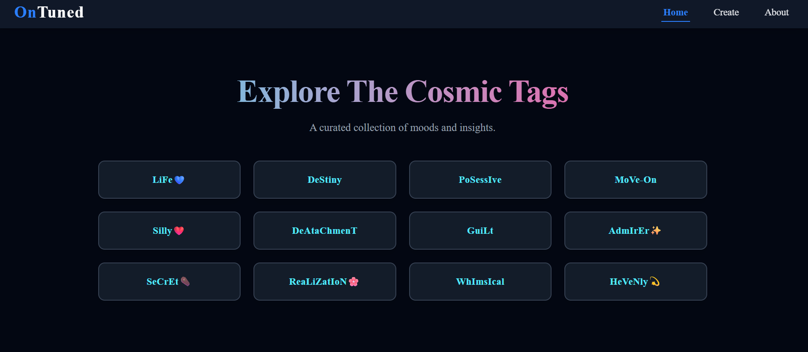

# OnTuned

OnTuned is a simple and fun platform where you can link your favourite music using **keywords**.  
Create your own mood-based chips, attach song URLs, and share your vibe anonymously.

---

## ✨ Features

- 🔗 **Attach Songs with Keywords**  
  Add any music URL (YT/Spotify etc.) and bind it to a keyword.

- 🏷️ **Create Your Own Sections**  
  Build a personalized collection of music chips based on your moods.

- 🕶️ **Anonymous Sharing**  
  Share music without revealing your identity.

- 🎯 **Default Keywords Included**  
  Mood-based tags are preloaded for quick access.

- ⚡ **Instant Navigation**  
  Clicking any keyword jumps directly to your linked song.

- 🌐 **Runs Easily with Live Server**  
  No backend — just open and enjoy.

---

## 🛠️ Tech Stack

- **HTML5**
- **CSS3**
- **JavaScript (ES6+)**
- **React.js**
- **Next.js**
- **Node.js** 

---

## 🚀 How to Run OnTuned

1. Download or clone the project.
2. Open the folder in your editor.
3. Run using **Live Server**.
4.  
   - Click any **default keyword chip** to open its linked track.  
   - Add your own **song URL + keyword** to create new chips.  
   - Your personal “section” displays all your added chips together.

---

## 📸 Screenshot




This is a [Next.js](https://nextjs.org) project bootstrapped with [`create-next-app`](https://github.com/vercel/next.js/tree/canary/packages/create-next-app).

## Getting Started

First, run the development server:

```bash
npm run dev
# or
yarn dev
# or
pnpm dev
# or
bun dev
```

Open [http://localhost:3000](http://localhost:3000) with your browser to see the result.

You can start editing the page by modifying `app/page.js`. The page auto-updates as you edit the file.

This project uses [`next/font`](https://nextjs.org/docs/app/building-your-application/optimizing/fonts) to automatically optimize and load [Geist](https://vercel.com/font), a new font family for Vercel.

## Learn More

To learn more about Next.js, take a look at the following resources:

- [Next.js Documentation](https://nextjs.org/docs) - learn about Next.js features and API.
- [Learn Next.js](https://nextjs.org/learn) - an interactive Next.js tutorial.

You can check out [the Next.js GitHub repository](https://github.com/vercel/next.js) - your feedback and contributions are welcome!

## Deploy on Vercel

The easiest way to deploy your Next.js app is to use the [Vercel Platform](https://vercel.com/new?utm_medium=default-template&filter=next.js&utm_source=create-next-app&utm_campaign=create-next-app-readme) from the creators of Next.js.

Check out our [Next.js deployment documentation](https://nextjs.org/docs/app/building-your-application/deploying) for more details.
